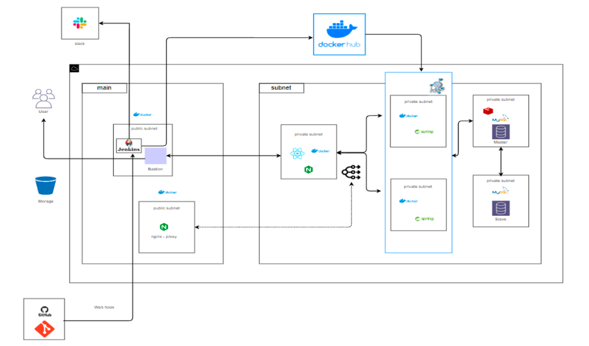
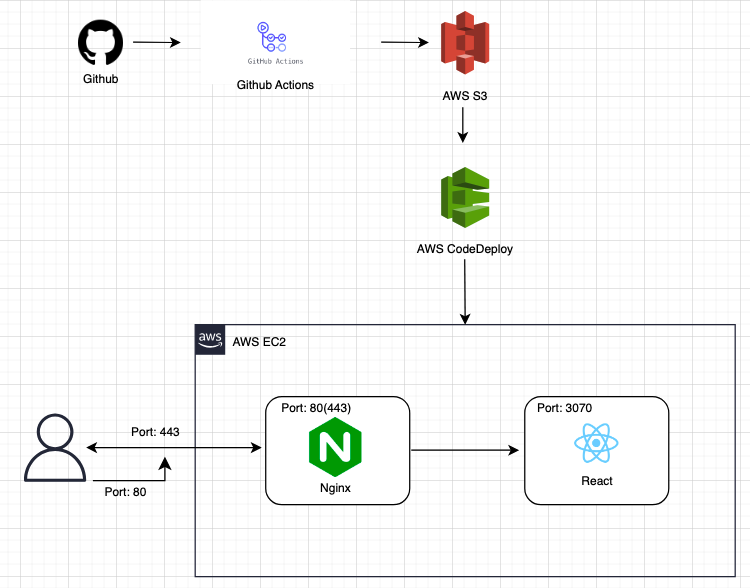

# UpLog
기업, 개발자, 의뢰인이 소통할 수 있는 릴리즈 노트 공유 시스템을 개발하였습니다. 현재 리팩터링을 진행하고 있습니다. 이 프로젝트는 개발을 시작하기 전에 2주 동안 프로젝트의 컨셉과 UI를 설계하고 개발을 시작했습니다.

<br/>

### 👥  참여인원
- 가천대학교 컴퓨터공학과 권오현 [Gitgub](https://github.com/5hyun) | qhslsl@gmail.com

- 가천대학교 소프트웨어학과 오채영 [Gitgub](https://github.com/CHCHAENG) | oco6029@naver.com

<br/>


## 🎯 기술 스택
yarn berry<br/> 
vite<br/>
React<br/>
TypeScript<br/>
Recoil<br/>
React Query<br/>
Tailwind CSS<br/>
Jest

<br/>

## 📝 Architecture 설계도
-Kakao I Cloud 이용


-AWS 이용


## 💻 프로젝트 실행 방법

```shell
git@github.com:GAK-coding/UpLog-frontEnd.git
cd UpLog-frontEnd
yarn
yarn dev
```

<br/>

## Demo 영상
https://www.youtube.com/watch?v=Jk-_V03pTn0
<br/>
<br/>

## ❓ UpLog 프로젝트 소개
1. [메인페이지&회원가입](#메인페이지&회원가입)
2. [로그인](#로그인)
    - [비밀번호 찾기](#비밀번호-찾기)
3. [마이페이지](#마이페이지)
    - [회원정보 수정](#회원정보-수정)
    - [휴면계정&계정탈퇴](#휴면계정--계정탈퇴)
    - [폼 조회](#폼-조회)

4. [설문 생성](#설문-생성)
    - [직접 생성](#직접-생성)
    - [템플릿](#템플릿)
    - [챗봇 생성](#챗봇-생성)

5. [설문 응답](#설문-응답)
6. [응답 분석](#응답-분석)
7. [Float Button](#Float-Button)

<br/>
<br/>

## 메인페이지

## 로그인&회원가입

### 비밀번호 찾기


## 마이페이지

### 회원정보 수정
### 휴면계정 & 계정탈퇴

### 폼 조회

## 설문 생성

### 직접 생성

### 템플릿

### 챗봇 생성

## 설문 응답

## 응답 분석

## Float Button
